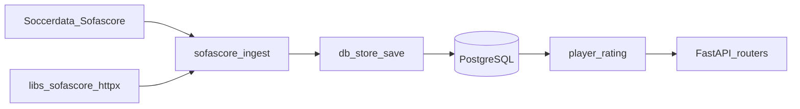

# winner-prediction

FotMob 기반 축구 데이터 적재·DB 모델·승무패 확률 예측 REST API를 아우르는 기술 레퍼런스입니다. **현재 코드베이스는 Sofascore(`soccerdata.Sofascore` + `libs/sofascore_httpx`) 기준**이며, 경기 PK·API 식별자는 **`game_id`**(Sofascore 이벤트 id)입니다.

---

## 목차

1. [프로젝트 개요](#1-프로젝트-개요)
2. [아키텍처와 데이터 흐름](#2-아키텍처와-데이터-흐름)
3. [외부 데이터 소스: FotMob](#3-외부-데이터-소스-fotmob)
4. [데이터베이스 모델 (테이블·필드 전부)](#4-데이터베이스-모델-테이블필드-전부)
5. [저장 전략 (UPSERT)](#5-저장-전략-upsert)
6. [예측 로직 요약](#6-예측-로직-요약)
7. [HTTP API 명세 (`/api/v1`)](#7-http-api-명세-apiv1)
8. [배치 태스크](#8-배치-태스크)
9. [설정·환경 변수](#9-설정환경-변수)
10. [마이그레이션·실행 힌트](#10-마이그레이션실행-힌트)
11. [기타 참고](#11-기타-참고)

---

## 1. 프로젝트 개요

| 항목 | 내용 |
|------|------|
| 목적 | Sofascore에서 수집한 축구 데이터를 PostgreSQL에 적재하고, 선발 라인업 기반 **홈 승·무승부·원정 승** 확률을 API로 제공 |
| API 앱 | FastAPI (`server/app/main.py`), OpenAPI 제목 `winner-prediction`, 설명 `Sofascore 기반 축구 승부 예측 API`, 버전 `0.1.0` |
| 패키지 레이아웃 | Poetry, 패키지 `server`·`libs/sofascore_httpx`·`client` (`pyproject.toml`) |
| 런타임 | `pyproject.toml` 선언: Python `>=3.14,<3.15` |
| HTTP | httpx (`libs/sofascore_httpx`), 스케줄용 `soccerdata` |
| DB 마이그레이션 | Alembic (`alembic/`, `poetry run alembic upgrade head`) |

---

## 2. 아키텍처와 데이터 흐름



- **적재**: `soccerdata.Sofascore.read_schedule`로 `game_id`·스케줄 확보, `libs/sofascore_httpx`로 라인업·통계 보완 → `server/app/integrations/sofascore_ingest.py`가 SQLModel 조립 → `server/app/store/db_store.py` UPSERT.
- **예측·조회**: `server/app/compute/player_rating.py`, `server/app/services/**`, `server/app/api/**`.

---

## 3. 외부 데이터 소스: Sofascore (기준점)

**베이스·기준점은 항상 Sofascore**입니다. `soccerdata.Sofascore`는 스케줄·리그·시즌용, `libs/sofascore_httpx`는 경기 상세(라인업·통계·이벤트)용입니다.

| 구성 | 역할 |
|------|------|
| `from soccerdata import Sofascore` | `read_schedule()` → `game_id`, `league`, `season`, 팀명·스코어 |
| `libs/sofascore_httpx.SofascoreClient` | `api.sofascore.com/api/v1/event/{game_id}/…` |

배치: `server/app/tasks/task.py` — `fetch_games_for_league_season_task`, `fetch_game_detail_task(game_id)`.

---

## 3.x (legacy) FotMob

아래 FotMob 절은 **구 스펙 참고용**입니다. 신규 ingest는 사용하지 않습니다.

## 3. 외부 데이터 소스: FotMob (legacy)

### 3.1 기본 URL

| 설정 (`server/config/settings.py`) | 기본값 |
|-----------------------------------|--------|
| `fotmob_base_url` | `https://www.fotmob.com` |
| `fotmob_api_url` | `https://www.fotmob.com/api` |

HTTP 클라이언트는 `FotMobHTTPClient` (`server/utils/http/requests.py`)가 `fotmob_api_url`을 베이스로 사용합니다.

### 3.2 코드에서 호출하는 HTTP 엔드포인트

| 용도 | 메서드·경로 | 비고 |
|------|-------------|------|
| 팀 오버뷰 (스쿼드·픽스처 등) | `GET /data/teams?id={team_id}&ccode3=KOR` | 요청 헤더에 `x-mas: <FOTMOB_TEAMS_X_MAS>` (**`server/utils/http/requests.py` 상수**). 팀별 데이터는 이 응답 한 번으로 파싱합니다. |
| 경기 상세 JSON | `GET {fotmob_api_url}/data/matchDetails?matchId={match_id}` | **문서 네비게이션에 가까운 헤더** (`Accept: text/html...`, `Sec-Fetch-*` 등)로 요청 (`get_match_details`). 본문이 비거나 304면 `Cache-Control: no-cache`로 재시도. 응답이 JSON이어도 브라우저와 유사한 헤더를 맞춥니다. |
| 403 / `TURNSTILE_REQUIRED` | — | 로그에 안내됨. `.env`의 `fotmob_cookie` 또는 Playwright로 얻은 쿠키를 `FotMobHTTPClient(cookies=...)`에 넘기는 방식이 코드에 맞춰져 있습니다. |

### 3.3 팀 오버뷰 응답에서 쓰는 주요 경로

| 경로 (개략) | 매핑 대상 |
|-------------|-----------|
| `details`, `overview.venue` | `Team`: 이름, 국가, 리그, 경기장, 창단 연도 등 (`get_team_info_by_team_id`) |
| `squad.squad[0].members[0]` | `Manager` (`get_manager_info_by_team_id`) |
| `squad.squad[1:]` 각 그룹 `members[]` | `Player`, `PlayerInfos`: `id`, `name`, `age`, `positionIdsDesc`→`position` 리스트, `role`, `shirtNumber`, `height`, 생일 등 (`get_players_info_by_team_id`) |
| `fixtures.allFixtures.fixtures[]`, `nextMatch` | `MatchLogs`, `MatchInfos`, 초기 `MatchDetails`(홈/어웨이 점수만) (`get_match_logs_info_by_team_id`) |

`fixtures` 항목에서 사용하는 필드 예: `id`, `status.utcTime`, `status.finished`, `status.cancelled`, `notStarted`, `home`/`away`의 `id`, `score`.

### 3.4 `matchDetails` JSON에서 쓰는 주요 경로

파싱 진입점: `FotMobCrawler.parse_match_details_json` (`server/app/crawler/fotmob.py`).

| JSON 경로 | 용도 |
|-----------|------|
| `general` | 홈/어웨이 팀 id, `matchTimeUTCDate`, `matchName`, `leagueName`, `matchRound` 등 → `MatchInfos` |
| `header.teams`, `header.status` | 스코어, 종료 여부, 승부차기, `scoreStr` 등 → `MatchDetails` |
| `content.stats.Periods.All.stats` | 팀별 집계 스탯 (`parse_team_stats` 내부) |
| `content.lineup.homeTeam` / `awayTeam` | `formation`, `rating`, `starters`, `subs` → 라인업 ID, `player_ratings`, `lineup_power_rating`(현재 `_calculate_lineup_power_rating`는 `None` 반환) |
| `content.matchFacts` | `infoBox`(경기장·주심·관중·날씨), `playerOfTheMatch` → `potm_player_id` |
| `content.events` | `MatchInfos.events` |
| `content.shotmap` | `MatchInfos.shotmap`, 선수별 `shot_events` 추출 |
| `content.playerStats` (경기 종료 시) | 선수별 상세 → `PlayerMatchDetails` (`_parse_player_match_details`) |

#### 3.4.1 팀 통계: `category_map`에 매핑되는 FotMob `stat.key` (그룹화)

| stat.key | JSON 그룹 필드 | 개별 컬럼 필드 (`MatchDetails`) |
|----------|------------------|--------------------------------|
| `total_shots`, `Shots` | `attack_stats.shots_total` | `shots_total` |
| `ShotsOnTarget` | `attack_stats.shots_on_target` | `shots_on_target` |
| `ShotsOffTarget` | `attack_stats.shots_off_target` | — |
| `blocked_shots` | `attack_stats.shots_blocked` | — |
| `shots_inside_box` | `attack_stats.shots_inside_box` | — |
| `shots_outside_box` | `attack_stats.shots_outside_box` | — |
| `big_chance` | `attack_stats.big_chances` | `big_chances` |
| `big_chance_missed_title` | `attack_stats.big_chances_missed` | `big_chances_missed` |
| `matchstats.headers.tackles` | `defense_stats.tackles` | — |
| `interceptions` | `defense_stats.interceptions` | — |
| `clearances` | `defense_stats.clearances` | — |
| `shot_blocks` | `defense_stats.blocks` | — |
| `keeper_saves` | `defense_stats.keeper_saves` | — |
| `duel_won` | `duel_stats.duels_won_total` | — |
| `aerials_won` | `duel_stats.duels_aerial_won` | — |
| `ground_duels_won` | `duel_stats.duels_ground_won` | — |
| `fouls` | `discipline_stats.fouls` | `fouls` |
| `yellow_cards` | `discipline_stats.yellow_cards` | `yellow_cards` |
| `red_cards` | `discipline_stats.red_cards` | `red_cards` |
| `corners` | `general_stats.corners` | `corners` |
| `Offsides` | `general_stats.offsides` | `offsides` |

추가 분기(같은 함수 내):

- 키 이름이 `ballpossession` / `ballpossesion`(오타) 계열 → `possession`, `general_stats.possession` (%에서 숫자 파싱).
- `accurate_passes` → 문자열 `"NNN (XX%)"` 형태면 성공 수·성공률 파싱 → `passing_stats`, `accurate_passes`.
- `passes` → `total_passes`, `passing_stats.total_passes`.
- `long_balls_accurate` → `passing_stats.long_balls_accuracy`.
- `accurate_crosses` → `passing_stats.crosses_accuracy`.
- `expected_goals` / `expectedgoals` / `xg` / `expected_goals_all` → `attack_stats.xG`, `expected_goals_value`.
- `expected_assists` / `xa` → `attack_stats.xA`, `expected_assists_value`.
- `expected_goals_on_target` / `xgot` → `attack_stats.xGOT`, `expected_goals_on_target_value`.

#### 3.4.2 선수 통계 (`_parse_player_match_details`)

`playerStats`의 각 선수 객체에서 `stats` 그룹을 펼쳐 `raw_stats[key]`로 모읍니다. 매핑에 쓰이는 키 예시(코드에 나오는 것):  
`minutes_played`, `rating_title`, `goals`, `assists`, `total_shots`, `expected_goals`, `expected_assists`, `expected_goals_on_target`, `accurate_passes`(value/total), `passes_into_final_third`, `key_passes`, `long_balls_won`, `long_passes_completed`, `accurate_crosses`, `matchstats.headers.tackles`, `tackles_won`, `interceptions`, `clearances`, `recoveries`, `shot_blocks`, `dribbles_stopped`, `dribbled_past`, `ground_duels_won`, `aerials_won`, `fouls` 등.  
카드는 `performance.yellowCard`/`redCard` 불리언으로 집계합니다. 슈팅 이벤트는 `shotmap`에서 `playerId` 일치 항목을 묶어 `shot_events` JSON에 넣습니다.

**참고**: `PlayerMatchDetails` 모델에는 `substitution_*`, `injury_event`, `season_*`, `is_team_top_player` 등도 있으나, 현재 `_parse_player_match_details` 반환은 위에서 채운 필드 위주이며 나머지는 기본값일 수 있습니다.

### 3.5 본 저장소의 비-FotMob 스크립트

루트의 `crawling_task.py`는 `from soccerdata import Sofascore` 한 줄 수준이며, **서버 FotMob 파이프라인과는 별개**입니다.

---

## 4. 데이터베이스 모델 (테이블·필드 전부)

공통: **`TimestampMixin`** (`server/utils/model/db_model.py`)이 붙은 테이블은 `created_at`, `updated_at` (타임존 인식 `DateTime`, 서버 기본 `now()`).  
예외: **`player_ratings`** 테이블은 `TimestampMixin` 없이 자체 `created_at`만 사용합니다.

아래에서 **PK** = Primary Key, **FK** = Foreign Key, **UK** = Unique.

### 4.1 `teams` (`Team`, `__tablename__ = "teams"`)

| 필드 | 타입·제약 | 설명 |
|------|-----------|------|
| `id` | int, PK | FotMob 팀 ID |
| `name` | str, max 255, UK, not null | 팀 이름 |
| `country` | str?, max 128 | 국가 |
| `league` | str?, max 128 | 리그 |
| `league_id` | int? | 리그 ID |
| `founded` | int? | 창단 연도 |
| `stadium` | str?, max 255 | 경기장 이름 |
| `stadium_capacity` | int? | 수용 인원 |
| `stadium_location` | str?, max 255 | 위치(JSON 문자열로 저장될 수 있음) |
| `stadium_city` | str?, max 128 | 도시 |
| + TimestampMixin | | |

관계(읽기용): `manager`, `player_infos`, `match_details`, `match_affect_features`, `player_match_details`.

### 4.2 `manager` (`Manager`)

| 필드 | 타입·제약 | 설명 |
|------|-----------|------|
| `id` | int, PK | FotMob 감독 ID |
| `name` | str, max 255, not null | 이름 |
| `age` | int? | 나이 |
| `country` | str?, max 128 | 국가 |
| `team_id` | int?, FK `teams.id` ON DELETE SET NULL | 소속 팀 |
| + TimestampMixin | | |

### 4.3 `players` (`Player`)

| 필드 | 타입·제약 | 설명 |
|------|-----------|------|
| `id` | int, PK | FotMob 선수 ID |
| + TimestampMixin | | |

관계: `info` → `PlayerInfos`(1:1), `match_affect_features` → `PlayerMatchAffectFeatures`(1:1), `match_details` → `PlayerMatchDetails`(1:N), `ratings` → `PlayerRating`(1:N).

### 4.4 `player_infos` (`PlayerInfos`)

| 필드 | 타입·제약 | 설명 |
|------|-----------|------|
| `id` | int, PK, FK `players.id` ON DELETE CASCADE | 선수 ID와 동일 |
| `team_id` | int?, FK `teams.id` ON DELETE SET NULL | 소속 팀 |
| `name` | str, max 255, not null | 이름 |
| `age` | int? | 나이 |
| `position` | JSON?, list[str] | 포지션 목록 (예: `positionIdsDesc` split) |
| `role` | JSON?, dict | 역할 상세 |
| `shirt_number` | int? | 등번호 |
| `height` | int? | 키 |
| `weight` | int? | 몸무게 |
| `birth_date` | str?, max 32 | 생년월일 문자열 |
| `birth_place` | str?, max 255 | 출생지 |
| `birth_country` | str?, max 128 | 출생국 |
| `birth_state` | str?, max 128 | 출생 지역 |
| `nationality_code` | str?, max 16 | 국적 ISO 등 |
| `team_internal_rankings` | JSON?, list[dict] | 팀 내 카테고리 순위/통계 (주석 구조 참고) |
| `season_category_stats` | JSON?, list[dict] | 시즌 카테고리 통계 |
| `market_value_history` | JSON?, list[dict] | 시장 가치 추이 |
| `current_market_value` | int? | 현재 시장 가치 (예측에 사용) |
| `peak_market_value` | int? | 최고 시장 가치 |
| `market_value_change_percentage` | float? | 가치 변동률 |
| `transfer_fee_history` | JSON?, list[dict] | 이적료 이력 |
| `season_statistics` | JSON?, list[dict] | 시즌별 통계 |
| `career_statistics` | JSON?, dict | 커리어 통계 |
| `transfer_history` | JSON?, list[dict] | 이적 이력 |
| `social_media_followers` | JSON?, dict | SNS 팔로워 |
| `news_mentions_count` | int? | 뉴스 언급 |
| `search_trend_score` | float? | 검색 트렌드 |
| `fan_rating` | float? | 팬 평점 (예측에 사용) |
| `media_attention_score` | float? | 미디어 주목도 |
| `contract_status` | JSON?, dict | 계약 정보 |
| `awards` | JSON?, list[dict] | 수상 |
| + TimestampMixin | | |

### 4.5 `player_match_affect_features` (`PlayerMatchAffectFeatures`)

| 필드 | 타입·제약 | 설명 |
|------|-----------|------|
| `id` | int, PK, FK `players.id` ON DELETE CASCADE | 선수 ID |
| `team_id` | int?, FK `teams.id` ON DELETE SET NULL | 팀 |
| `performance_trend` | JSON?, list[dict] | 성적 추이 |
| `injury_history` | JSON?, list[dict] | 부상 이력 |
| `current_form` | str?, max 32 | 현재 폼 문자열 |
| `form_rating` | float? | 폼 점수 (예측에 사용) |
| `recent_matches` | JSON?, list[dict] | 최근 경기 기록 |
| `availability_status` | str?, max 64 | 출전 가능 여부 |
| `national_team_caps` | int? | 국대 캡 |
| `recently_played_national_team` | bool? | 최근 국대 출전 여부 |
| `playing_time_stats` | JSON?, dict | 출전 시간 통계 |
| `comparison_with_peers` | JSON?, dict | 동료 대비 지표 |
| + TimestampMixin | | |

### 4.6 `player_match_details` (`PlayerMatchDetails`)

복합 PK: (`match_id`, `id`).  
FK: `match_id` → `match_logs.id` ON DELETE CASCADE, `id` → `players.id` ON DELETE CASCADE, `team_id` → `teams.id` ON DELETE CASCADE.  
복합 FK: `(match_id, team_id)` → `match_details(id, team_id)` 제약 이름 `fk_player_match_details_match_details`.

| 필드 | 타입 | 비고 |
|------|------|------|
| `position` | str? | 경기 포지션 |
| `minutes_played` | int? | 출전 시간(분) |
| `is_starter` | bool | 선발 |
| `substitution_in_minute` | int? | 교체 인 |
| `substitution_out_minute` | int? | 교체 아웃 |
| `rating` | float? | FotMob 경기 평점 |
| `is_man_of_the_match` | bool | MOM |
| `goals` | int | 골 |
| `assists` | int | 어시스트 |
| `shots_total` | int? | 슈팅 |
| `shots_on_target` | int? | 유효 슈팅 |
| `expected_goals` | float? | xG |
| `expected_goals_on_target` | float? | xGOT |
| `expected_assists` | float? | xA |
| `expected_goals_plus_assists` | float? | xG+xA |
| `passes_completed` | int? | 패스 성공 |
| `passes_attempted` | int? | 패스 시도 |
| `pass_accuracy` | float? | 패스 성공률(%) |
| `final_third_passes` | int? | 파이널 서드 패스 |
| `long_passes_completed` | int? | 롱패스 성공 |
| `crosses_completed` | int? | 크로스 성공 |
| `tackles` | int? | 태클 |
| `interceptions` | int? | 인터셉트 |
| `clearances` | int? | 클리어링 |
| `recoveries` | int? | 리커버리 |
| `blocks` | int? | 블록 |
| `dribbles_stopped` | int? | 드리블 저지 |
| `ground_duels_won` / `ground_duels_total` | int? | 지상 듀얼 |
| `ground_duels_win_rate` | float? | 지상 듀얼 승률 |
| `aerial_duels_won` / `aerial_duels_total` | int? | 공중 듀얼 |
| `aerial_duels_win_rate` | float? | 공중 듀얼 승률 |
| `shot_events` | JSON?, list[dict] | 슈팅 이벤트 |
| `yellow_cards` / `red_cards` | int | 카드 |
| `fouls` | int? | 파울 |
| `injury_event` | JSON?, dict | 부상 이벤트 |
| `season_goals` / `season_assists` | int? | 시즌 누적 |
| `season_average_rating` | float? | 시즌 평균 평점 |
| `is_team_top_player` | bool | 팀 내 top 여부 |
| + TimestampMixin | | |

### 4.7 `player_ratings` (`PlayerRating`)

append-only 로그. **`TimestampMixin` 없음.**

| 필드 | 타입·제약 | 설명 |
|------|-----------|------|
| `id` | int?, PK (자동 증가 가정) | 로그 행 ID |
| `player_id` | int, FK `players.id` ON DELETE CASCADE, index, not null | 선수 |
| `rating` | float, not null | 계산된 레이팅 |
| `created_at` | datetime TZ, not null, server default `now()` | 생성 시각 |

### 4.8 `match_logs` (`MatchLogs`)

| 필드 | 타입·제약 | 설명 |
|------|-----------|------|
| `id` | int, PK | FotMob 경기 ID |
| + TimestampMixin | | |

관계: `match_infos`, `match_details`.

### 4.9 `match_infos` (`MatchInfos`)

| 필드 | 타입·제약 | 설명 |
|------|-----------|------|
| `id` | int, PK, FK `match_logs.id` ON DELETE CASCADE | 경기 ID |
| `home_team_id` | int, FK `teams.id` | 홈 |
| `away_team_id` | int, FK `teams.id` | 어웨이 |
| `match_date` | datetime TZ, not null | 경기 일시 |
| `match_name` | str? | 표시용 명칭 |
| `league_name` | str? | 리그 |
| `match_round` | str? | 라운드 |
| `match_time_utc` | str? | UTC 시간 문자열 |
| `stadium` | str? | 경기장 |
| `referee` | str? | 주심 |
| `attendance` | int? | 관중 |
| `weather` | JSON? | 날씨 |
| `next_match` | bool | 예정 경기 여부 등 |
| `finished` | bool | 종료 |
| `cancelled` | bool | 취소 |
| `halfs_info` | JSON? | 전후반 시각 등 |
| `events` | JSON?, list[dict] | 이벤트 로그 |
| `shotmap` | JSON? | 슈팅맵 |
| + TimestampMixin | | |

### 4.10 `match_details` (`MatchDetails`)

복합 PK: (`id`, `team_id`).  
FK: `id` → `match_logs.id` ON DELETE CASCADE, `team_id` → `teams.id` ON DELETE CASCADE, `potm_player_id` → `players.id` ON DELETE SET NULL.

| 필드 | 타입 | 설명 |
|------|------|------|
| `is_home` | bool | 홈 여부 |
| `score` | int | 해당 팀 득점 |
| `penalty_score` | int? | 승부차기 골 |
| `is_penalty_loser` | bool | 승부차기 패배 |
| `score_str` | str? | 스코어 문자열 |
| `penalty_shootout_reason` | str? | 승부차기 설명 |
| `expected_goals_value` | float? | xG |
| `expected_assists_value` | float? | xA |
| `expected_goals_on_target_value` | float? | xGOT |
| `possession` | float? | 점유율 |
| `shots_total` | int? | 슈팅 |
| `shots_on_target` | int? | 유효 슈팅 |
| `big_chances` | int? | 빅찬스 |
| `big_chances_missed` | int? | 빅찬스 미스 |
| `corners` | int? | 코너 |
| `fouls` | int? | 파울 |
| `yellow_cards` / `red_cards` | int? | 카드 |
| `accurate_passes` / `total_passes` | int? | 패스 |
| `offsides` | int? | 오프사이드 |
| `attack_stats` | JSON dict | 공격 스탯 그룹 |
| `passing_stats` | JSON dict | 패스 그룹 |
| `defense_stats` | JSON dict | 수비 그룹 |
| `duel_stats` | JSON dict | 듀얼 그룹 |
| `discipline_stats` | JSON dict | 징계 그룹 |
| `general_stats` | JSON dict | 기타 |
| `starting_players` | JSON list[int] | 선발 선수 ID |
| `substitute_players` | JSON list[int] | 교체 선수 ID |
| `player_ratings` | JSON dict[str,float] | 선수별 평점 맵 |
| `lineup_power_rating` | float? | 라인업 전력(현재 크롤러는 대개 null) |
| `formation` | str?, max 16 | 포메이션 |
| `team_rating` | float? | 팀 평점 |
| `potm_player_id` | int?, FK | MOM 선수 |
| + TimestampMixin | | |

### 4.11 `bets` (`Bets`)

| 필드 | 타입·제약 | 설명 |
|------|-----------|------|
| `id` | int, PK | (의도 미상) |
| `name` | str, max 255, not null | 이름 |
| `age` | int? | 나이 |
| + TimestampMixin | | |

**현재 코드베이스에서 크롤러·태스크·서비스가 이 테이블을 쓰지 않습니다.** 스키마만 존재합니다.

---

## 5. 저장 전략 (UPSERT)

- 함수: `upsert_model` / `save` (`server/app/store/db_store.py`).
- PostgreSQL `INSERT ... ON CONFLICT DO UPDATE` 사용.
- 충돌 키: 모델에 `__upsert_conflict_cols__`가 있으면 그것을 쓰고, **없으면 테이블의 PK 컬럼들**. 현재 모델에 `__upsert_conflict_cols__` 정의는 없으며 **전부 PK 기준**입니다.
- 업데이트 시 충돌 컬럼을 제외한 나머지 컬럼을 `excluded`로 갱신합니다.

---

## 6. 예측 로직 요약

파일: `server/app/compute/player_rating.py`.

### 6.1 `compute_player_rating(player)`

대략적 구성:

1. 기준값 1500에서 출발.
2. `PlayerInfos.current_market_value` log10 스케일 가산.
3. 나이 피크(27) 기준 페널티.
4. `PlayerMatchAffectFeatures`: 가용성 문자열에 injury/suspend 등 → 감점, `injury_history` 길이 감점.
5. 폼: `form_rating` 우선, 없으면 최근 경기(출전·평점 있는 것) 가중 평균.
6. `fan_rating` 또는 최근 `PlayerMatchDetails.season_average_rating` 보조.
7. 최근 N경기 per90 공격·수비·패스 지표를 포지션 버킷(`goalkeeper`/`defender`/`midfielder`/`forward`)에 따라 가중 합산, 카드/MOTM 보정.
8. 최종 `[900, 2300]` 클램프.

포지션 버킷은 `PlayerInfos.position[0]` 또는 `PlayerMatchDetails.position` 문자열에서 휴리스틱으로 분류합니다.

### 6.2 `compute_lineup_features`

선발 명단에 대해 `compute_player_rating` 합산, 포지션별 공격/수비 가중, 인원 &lt; 11이면 평균으로 패딩, 휴식일·홈 등 컨텍스트(기본값) 반영.

### 6.3 `predict_match_outcomes`

- 홈·원정 각각 `compute_lineup_features`, `get_historical_win_rate`(홈/원정 각각 최근 N`MatchDetails`)로 logit 3개 구성 후 `softmax` → `home`/`draw`/`away` 확률.

### 6.4 API와의 연결

- `predictions`·`matches?include_outcomes`·`visualization` 라인업 API는 **`MatchDetails.starting_players`**에 있는 선수 ID로 DB에서 선수를 적재해 예측·차트에 사용합니다.

---

## 7. HTTP API 명세 (`/api/v1`)

공통 prefix: `API_V1_PREFIX = "/api/v1"` (`server/app/main.py`).  
FastAPI 기본 문서: 서버 실행 후 **`/docs`** (Swagger), **`/redoc`**.

### 7.1 Health

| 항목 | 내용 |
|------|------|
| 메서드·경로 | `GET /api/v1/health` |
| 응답 모델 | `HealthRead` — `status: str` (현재 구현은 `"ok"`) |
| 스키마 | `server/app/schemas/health.py` |

### 7.2 최근 경기 목록

| 항목 | 내용 |
|------|------|
| 메서드·경로 | `GET /api/v1/games/latest` |
| 쿼리 | `limit`, `include_outcomes` |
| 응답 | `LatestGamesRead`: `game_id`, 팀명, `score`, `stats`, `outcomes` |

(레거시 경로 `matches/latest` 대신 **`games/latest`** 및 응답 필드 **`game_id`** 사용.)

### 7.3 경기 승·무·패 확률

| 메서드·경로 | `GET /api/v1/predictions/games/{game_id}/outcomes` |
| 응답 200 | `MatchOutcomesRead`: `match_id`, `home_team_name`, `away_team_name`, `home`, `draw`, `away` (0~1) |
| 404 | 경기 없음 — `"경기를 찾을 수 없습니다."` |
| 422 | 홈/어웨이 `MatchDetails` 부족, 또는 선발 라인업 선수 정보 부족 |

### 7.4 시각화: 팀 스탯 비교

| 항목 | 내용 |
|------|------|
| 메서드·경로 | `GET /api/v1/visualization/games/{game_id}/team-stats` |
| 응답 200 | `TeamStatsComparisonRead`: `match_id`, `home_team_name`, `away_team_name`, `match_date`, `league_name`, **`metrics`**: `TeamMetricPoint[]` |
| `TeamMetricPoint` | `key`, `label`(한글), `home`, `away` |
| 실제 지표 키 | `score`, `expected_goals`, `possession`, `shots_total`, `shots_on_target`, `corners`, `big_chances`, `team_rating` |
| 404 / 422 | 예측 API와 동일한 패턴(경기 없음, 홈·어웨이 상세 없음) |

### 7.5 시각화: 라인업 레이팅

| 항목 | 내용 |
|------|------|
| 메서드·경로 | `GET /api/v1/visualization/games/{game_id}/lineup-ratings` |
| 응답 200 | `LineupRatingsRead`: `match_id`, 팀명, **`players`**: `LineupRatingPoint[]` — 선발만, **`model_rating` 내림차순** 정렬 |
| `LineupRatingPoint` | `player_id`, `name`, `is_home`, `model_rating`, `match_rating`(경기 JSON의 `player_ratings`에 있으면) |
| 422 | 선발 라인업 선수 정보 부족 |

---

## 8. 배치 태스크

`server/app/tasks/task.py`.

| 함수 | 동작 |
|------|------|
| `fetch_games_for_league_season_task(league, season)` | `read_schedule` → `games` / `game_infos` |
| `fetch_game_detail_task(game_id)` | `SofascoreClient` → 상세 UPSERT |
| `compute_player_rating_task(player_id)` | `PlayerRating` append |
| `compute_all_player_ratings_task()` | 전 선수 |

태스크 레지스트리(예시): 모듈 하단 `tasks` 리스트에 위 함수들이 이름으로 노출됩니다.

---

## 9. 설정·환경 변수

`server/config/settings.py` — Pydantic `BaseSettings`, 기본 `.env` 로드 (`env_file = ".env"`).

| 변수(대표) | 용도 |
|------------|------|
| `database_url` | `postgresql+asyncpg://...@localhost:5432/winner_prediction` |
| `database_url_sync` | Alembic용 `postgresql+psycopg://...` |
| `default_leagues`, `default_seasons` | soccerdata Sofascore ingest |
| `sofascore_data_dir` | soccerdata 캐시 |
| `http_timeout`, `http_max_retries`, `user_agent` | httpx |
| `cors_origins` | 프론트 CORS |

---

## 10. 마이그레이션·실행 힌트

- **Alembic**: `poetry run alembic upgrade head` — 초기 리비전 `001_init_sofascore_schema`.
- **FastAPI 앱**: `uvicorn server.app.main:app --reload` (호스트/포트는 환경에 맞게).
- **정적 웹**: `client/web_demo` 디렉터리가 있으면 `create_app()`이 `GET /`로 `index.html`, `/static`으로 정적 파일을 마운트합니다.
- **별도 데모 서버**: `python client/demo_server.py` — `http://127.0.0.1:8080`, 내장 경로 `GET /api/health`, `GET /api/matches/latest` 등 (`client/README_WEB_DEMO.md` 참고). 이는 FastAPI의 `/api/v1`과 **다른 포트·경로**입니다.

### 검증 커맨드 (프로젝트 규칙)

```bash
python -m compileall server client predict_test.py test.py
```

---

## 11. 기타 참고

- **식별자 정책**: 팀·선수·경기 id는 **Sofascore가 부여한 id**; 경기 키는 **`game_id`** (`games.id`).
- **OpenAPI**: 런타임에 실제 스키마·예시는 `/docs`를 기준으로 하면 됩니다.
- **데이터 완전성**: 예측·시각화는 DB에 선수 프로필과 선발 ID가 채워져 있어야 하며, 크롤 단계나 FK 순서에 따라 일부 필드는 비어 있을 수 있습니다.
